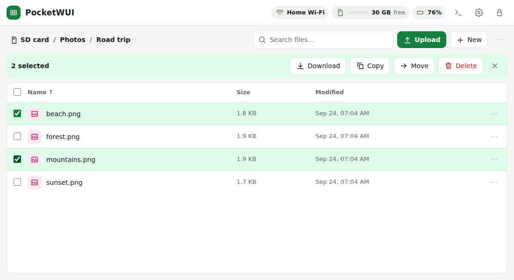
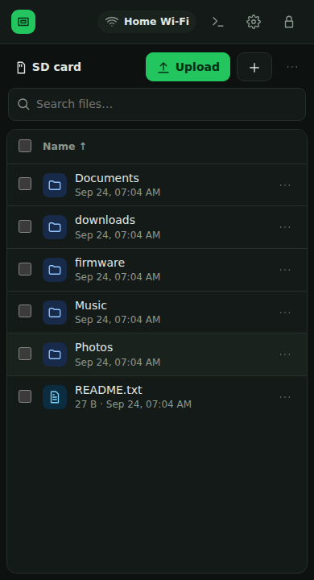

# PocketWUI

**Your Cardputer's SD card, in any browser.**

Browse, preview, upload and download files on your M5Stack Cardputer / Cardputer ADV (ESP32‑S3) from a phone or laptop, over Wi‑Fi or one USB cable. No app, no cloud, no internet needed.

  
  

> **Status:** 2.0 passes every automated test (host, simulator, browser) but hasn't run on real hardware yet. Tried it? [Open an issue](../../issues) either way.

## Features

- Drag-and-drop upload of files and folders, resumable, any size
- Previews: photos, video, music, PDF, text (with editor)
- Search the whole card, download any selection as one ZIP, Trash
- USB cable mode: network adapter at `http://192.168.7.1`, or lend the card as a USB drive
- QR codes on the device to join its Wi‑Fi and sign in
- WebDAV network drive (Finder, VLC, Infuse, rclone)
- Installs from M5Launcher, with a *Back to Launcher* button

## Install

1. Download **`PocketWUI.bin`** from the [latest release](../../releases/latest) and copy it to the SD card.
2. On the Cardputer: **M5Launcher → SD → `PocketWUI.bin` → Install**.

No Launcher? Flash `PocketWUI-full-flash.bin` at `0x0` with [esptool-js](https://espressif.github.io/esptool-js/) or
`esptool.py --chip esp32s3 write_flash 0x0 PocketWUI-full-flash.bin` (hold **G0** while plugging in).

## First run

1. The screen shows a Wi‑Fi name, key, address and a random password.
2. Press the side button for a QR code to join, and again for one that signs you in. Or join by hand and open `http://192.168.4.1`.
3. Add your home Wi‑Fi in **Settings → Wi‑Fi**, or on the Cardputer press **`w`**, pick a network (`;` / `.`), type the key and press **Enter**. Then use `http://cardputer.local`.
4. Set your own password in **Settings → Device**.

Forgot it? Hold the side button for 5 s to reset the password and Wi‑Fi (your files are kept).

## More

- **[Guide](docs/GUIDE.md)**: ways to connect, tips, M5Launcher, troubleshooting, privacy, test status
- **[Developing](docs/DEVELOPING.md)**: build, PC simulator, tests, HTTP/WebDAV API
- **[Changelog](CHANGELOG.md)**

Built on [M5Unified / M5GFX](https://github.com/m5stack/M5Unified), [EspUsbDevice](https://github.com/tanakamasayuki/EspUsbDevice) and [pioarduino](https://github.com/pioarduino/platform-espressif32). Works with [M5Launcher](https://github.com/bmorcelli/Launcher). [MIT licence](LICENSE).
